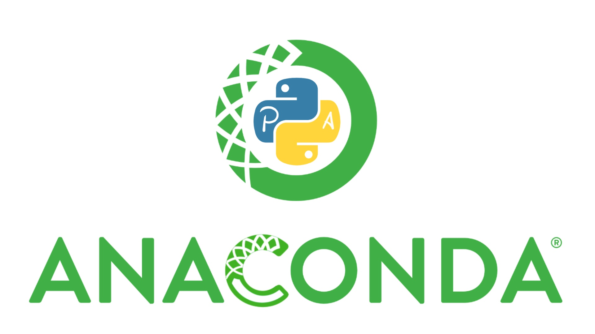

# Lecture1
***Quantom Computation***

**We are going to learn several Programming tools (Python,Anaconda,Google Colab etc) that will help us to construct knwoledges for machine learning , deep learning and Quantom mechanic**

***Installation***

[For anaconda](https://www.anaconda.com/download)

**For Python version 3+, we can download it directly from Anaconda. Google Colab do not require installation but can be used directly on site.**
